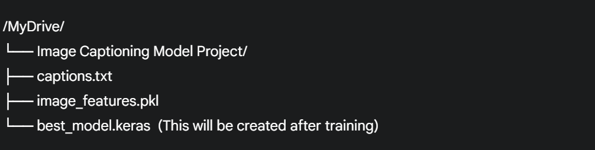

# Image Captioning with Deep Learning

This project implements a deep learning model to automatically generate descriptive captions for images. It uses a combination of a pre-trained Convolutional Neural Network (CNN) to extract image features and a Recurrent Neural Network (RNN) with LSTM units to generate the corresponding text sequences.

##  Features

- **Encoder-Decoder Architecture:** Utilizes the VGG16 model as the image feature extractor (encoder) and an LSTM-based network as the language model (decoder).
- **Efficient Data Handling:** A custom data generator is used to feed the model with batches of data, making it memory-efficient for large datasets.
- **Text Preprocessing:** Captions are cleaned, tokenized, and padded to a uniform length.
- **Advanced Training Techniques:** Implements callbacks like `ModelCheckpoint`, `EarlyStopping`, and `ReduceLROnPlateau` for robust training.

---

##  Technologies Used

- **Frameworks:** TensorFlow, Keras
- **Libraries:** NumPy, Matplotlib, PIL, Scikit-learn
- **Environment:** Google Colab (with GPU acceleration)

---

##  Project Structure

To run this project, your Google Drive should be organized as follows:

- **`captions.txt`**: A text file containing the image names and their corresponding captions. Each line should have the image name followed by a comma and the caption.
- **`image_features.pkl`**: A pickle file containing a dictionary where keys are image names and values are the extracted image features (e.g., from a pre-trained VGG16 model).
- **`best_model.keras`**: The trained Keras model will be saved here.

---

##  Model Architecture

The model consists of two main components:

### 1. Image Feature Extractor (Encoder)

- The model takes pre-extracted image features as input. These features are assumed to be of shape `(4096,)`.
- The features are passed through a `Dropout` layer for regularization and then a `Dense` layer to create a 256-dimensional representation of the image.

### 2. Caption Generator (Decoder)

- **Embedding Layer:** The input text (captions) is converted into a dense vector representation using an `Embedding` layer.
- **LSTM Layer:** An LSTM (Long Short-Term Memory) network processes the sequence of embedded words to capture temporal dependencies.
- **Merger:** The image features and the output of the LSTM are combined using an `add` layer.
- **Final Prediction:** The merged output is passed through a `Dense` layer with a `softmax` activation function to predict the next word in the caption from the vocabulary.

---

##  Getting Started

### Prerequisites

- A Google Account with access to Google Drive and Google Colab.
- The dataset files (`captions.txt` and `image_features.pkl`) uploaded to the correct path in your Google Drive.

### Step-by-Step Instructions

1.  **Open the Notebook in Google Colab:** Upload and open the `.ipynb` file in Google Colab.
2.  **Set the Runtime Type:** In the Colab menu, go to **Runtime** > **Change runtime type** and select **GPU** as the hardware accelerator.
3.  **Mount Google Drive:** The first cell of the notebook mounts your Google Drive to allow access to the project files. You'll need to authorize this connection.
4.  **Install Dependencies:** The second cell imports all the necessary libraries.
5.  **Load and Prepare Data:** The subsequent cells will:
    - Load the captions from `captions.txt`.
    - Clean and tokenize the captions.
    - Load the pre-extracted image features from `image_features.pkl`.
6.  **Define and Compile the Model:** The `define_model` function creates the model architecture, and it is then compiled with the Adam optimizer and categorical cross-entropy loss.
7.  **Train the Model:** The `train_model` function initiates the training process. The model will be trained for 20 epochs, and the best version will be saved to your Google Drive as `best_model.keras`.
8.  **Generate Captions (Inference):** After training, you can use the saved `best_model.keras` to generate captions for new images. You will need to extract the features of the new image using the same VGG16 model and then feed them into the trained captioning model.

---

##  Training

The model is trained with the following configuration:

- **Optimizer:** Adam
- **Loss Function:** Categorical Cross-Entropy
- **Batch Size:** 32
- **Epochs:** 20

The training process includes:
- **Model Checkpointing:** Saves the model with the lowest loss.
- **Early Stopping:** Stops the training if the loss doesn't improve for 5 consecutive epochs.
- **Learning Rate Reduction:** Reduces the learning rate if the loss plateaus.

The progress of the training, including the loss at each epoch, will be displayed in the output of the final cell.
